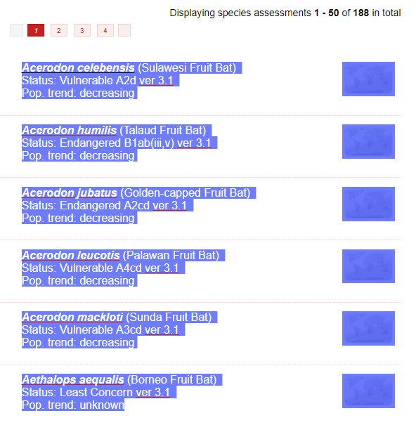

# IUCN parser

### Folder Structure:

IUCNparser (*root*)  
-- ICNparser.R  
-- *name of search query*  
    -- page1.txt  
    -- page2.txt  
    -- page3.txt  
    -- (*etc.*)

### Instructions for Use:

1. Visit http://www.iucnredlist.org/
2. Enter search query (i.e. 'Pteropodidae')
3. Copy the table of search results (be sure to omit the pagination buttons at the top and bottom of the page)
